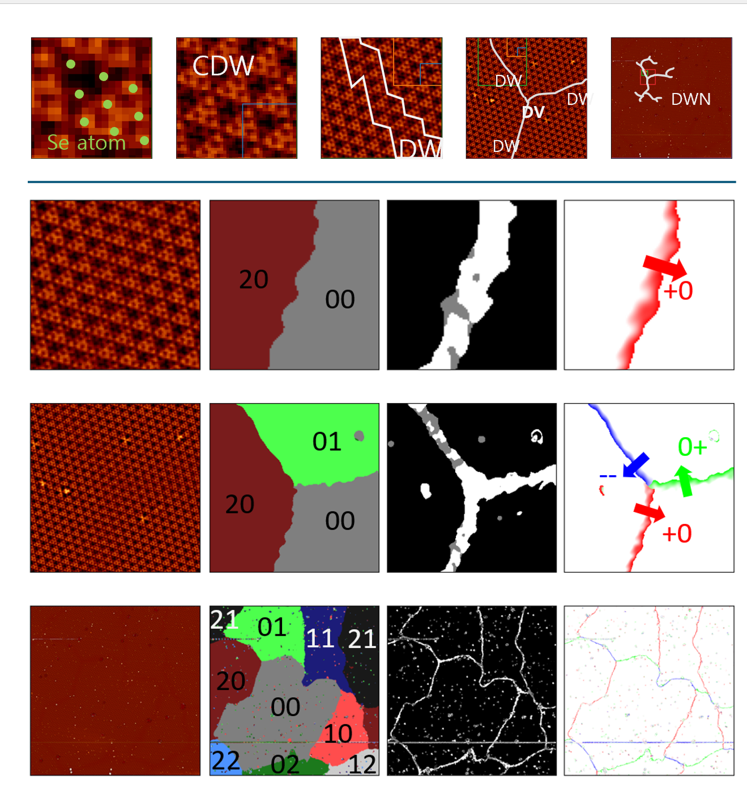
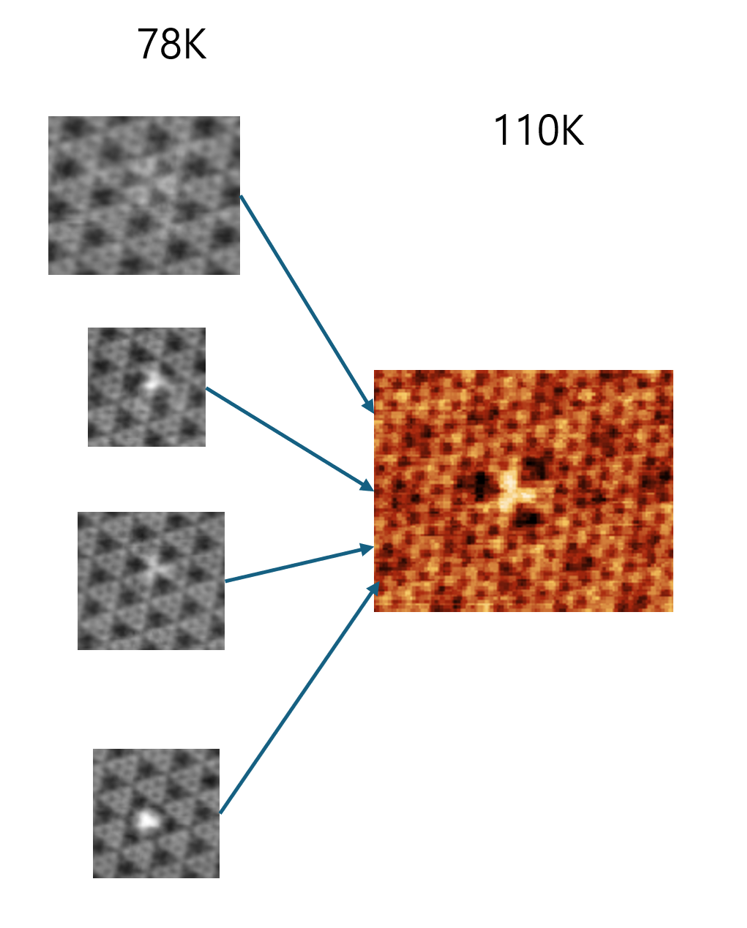

- 2H-TaSe2's STM data analysis done by [potdooshami](https://github.com/Potdooshami?tab=overview&from=2025-09-01&to=2025-09-29).
- The purpose of this repositiory is
  - Orgnaize the results of analysis 
  - back up the codes for data analysis
  - 

# Results
## Soliton Lattice 

## [Mcmillar's ICCDW transition](docs\ICCDW_transition\index.md)

## Topoligical point defect

# DataProcessing
## [Understading spatial lock-in tequenic](spatial_lockinTest.ipynb)
## Workflow of extracting phase map using spatial lock-in tecnique
# Project Managing
## file system
## Timeline(log)
