# Variable Temperature
## Topographic Texture
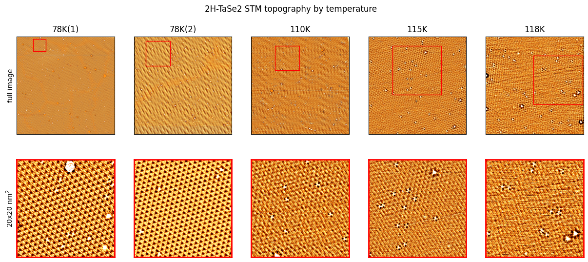  

**Observed Patterns**

- 78 K: Clear and well-defined periodic patterns are visible.
In the magnified view, both atomic lattice and CDW-related superlattice are clearly resolved.

- 110 K: Periodicity becomes weaker, and defect/impurity-like spots appear.

- 115 K & 118 K: Periodicity further deteriorates, with increased noise and defect density.
At 118 K, the periodic pattern is almost lost, leaving only blurred features.

**Physical Meaning**

- 2H-TaSe₂ is well-known for its Charge Density Wave (CDW) transition.

- At low temperature (78 K), a distinct CDW superstructure is present.

- As the temperature increases, the CDW weakens or disappears, leaving only faint atomic lattice signals.

- This image directly visualizes the temperature-driven CDW phase transition by STM.

**Conclusion**

- These STM topographies of 2H-TaSe₂ at various temperatures clearly demonstrate the evolution of CDW order.

- At 78 K, a well-developed CDW lattice is observed.

- From 110 K to 118 K, the CDW collapses and gradually fades away.

- This provides direct evidence that CDW is stable at low temperature but suppressed upon heating.
## 2D FFT
**2D FFT images**
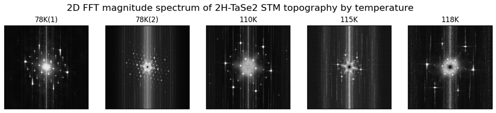
- 2D FFT spectra of STM topography at different temperatures (78 K → 118 K).
  
- The strong central peaks correspond to the atomic lattice.
  
- Additional surrounding satellite peaks correspond to the CDW superlattice.
  
- As temperature increases, the intensity of these satellite peaks becomes weaker and less defined
  
  
    
**peak analysis example**
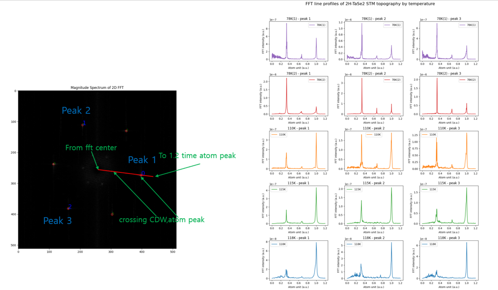
- FFT spectrum with labels “Peak 1, Peak 2, Peak 3.”

- Peak 1: CDW-related peak located near 1/3 of the lattice peak position.

- Peaks 2 and 3: CDW satellite peaks at other symmetric positions.

- Line profile analysis extracts both peak position (q-vector) and peak intensity.  

**CDW peak analysis results**
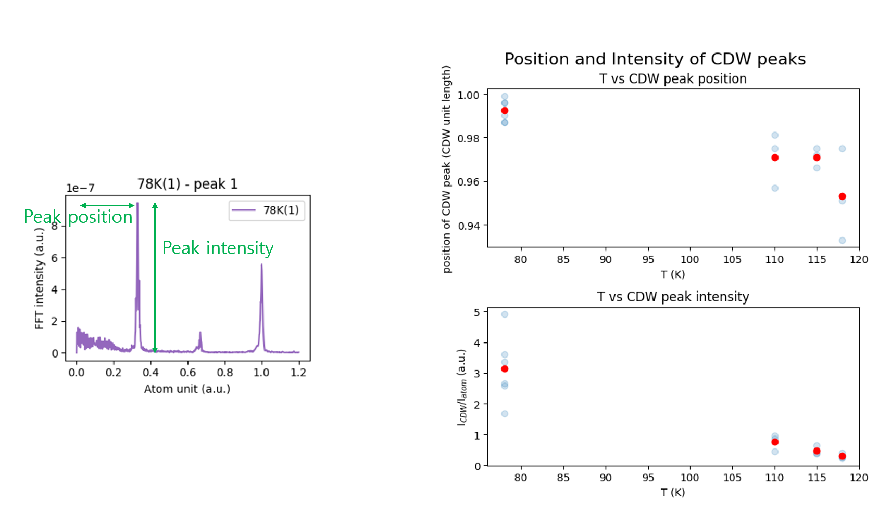  

- Example plot: FFT intensity vs reciprocal lattice unit (a.u.).

- Demonstrates how the position (q-vector) and intensity (FFT amplitude) of a CDW peak are measured.

- T vs CDW peak position:  
  
    CDW peak positions shift slightly with temperature, indicating small changes in the CDW wave vector.  
    Overall, the CDW wave vector tends to decrease as temperature increases.

- T vs CDW peak intensity:

    At 78 K, CDW peaks are strong.  
    Intensity decreases sharply with increasing temperature.

- Above ~115 K, the peaks nearly vanish, signaling the CDW phase transition.

**Physical Interpretation**
- 2H-TaSe₂ forms a commensurate CDW at low temperature.

- With increasing temperature, the CDW weakens and the satellite peaks disappear.

- This dataset demonstrates:

  - The CDW order parameter (intensity) decreases as T increases.

  - The CDW wave vector (Q) also shifts slightly with T.

## 2D Autocrrelation
**2D Autocorrelation maps**
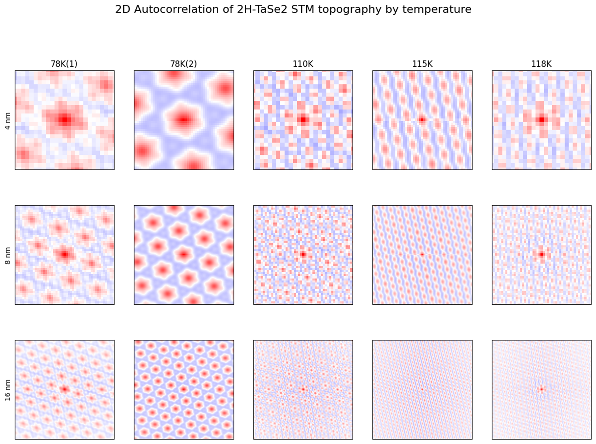
| Temperature | Observation |
|-------------|-------------|
| 78K (two samples) | Very clear hexagonal patterns across all ranges (4 nm, 8 nm, 16 nm). Long-range, periodically repeating CDW correlations are preserved. |
| 110K | The pattern remains but becomes much fainter, with correlations decaying rapidly. Short-range CDW traces are still visible, but long-range order is weakened. |
| 115K, 118K | The hexagonal correlation pattern almost disappears, leaving only the central region. In other words, the CDW maintains only localized short-range order, while long-range order vanishes. |

**line profile of 2D autocorrelation**
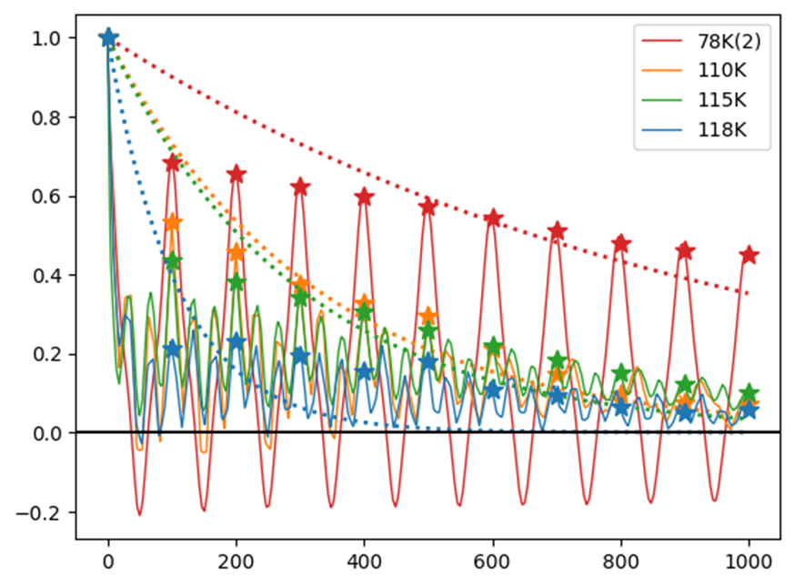
| Temperature | Observation |
|-------------|-------------|
| 78K (red) | Large amplitude, with clear oscillations persisting over multiple periods. The starred peak positions survive at long range, reflecting the long-range phase coherence of the CDW. |
| 110K (orange) | Peaks are visible for the first two or three periods, but the amplitude decays quickly. Correlation length is shortened. |
| 115K (green), 118K (blue) | Peak amplitudes are much smaller and quickly fall to the noise level. Correlation length is limited to just a few nanometers. |
## 2D phase map
### global flow
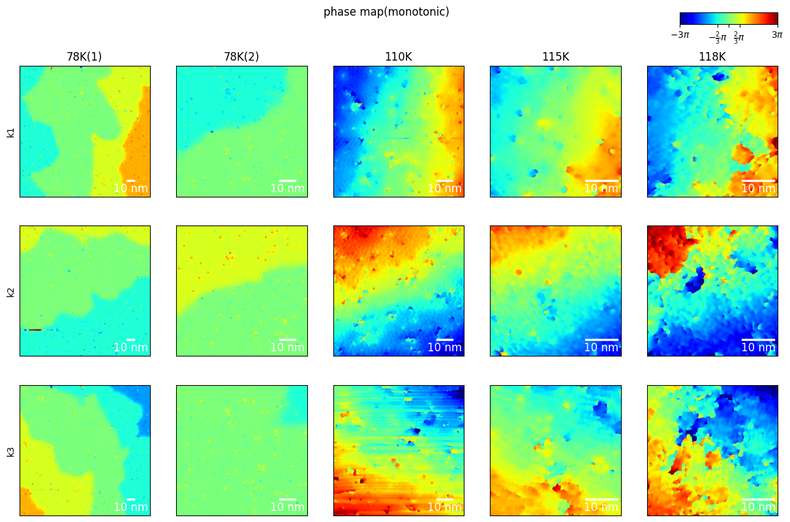

- We can check the flow of phase exist
- the direction is parallel with corresponding k vector.
- some phase are more prefered than the others and seems periodic.
considering
### CDW period
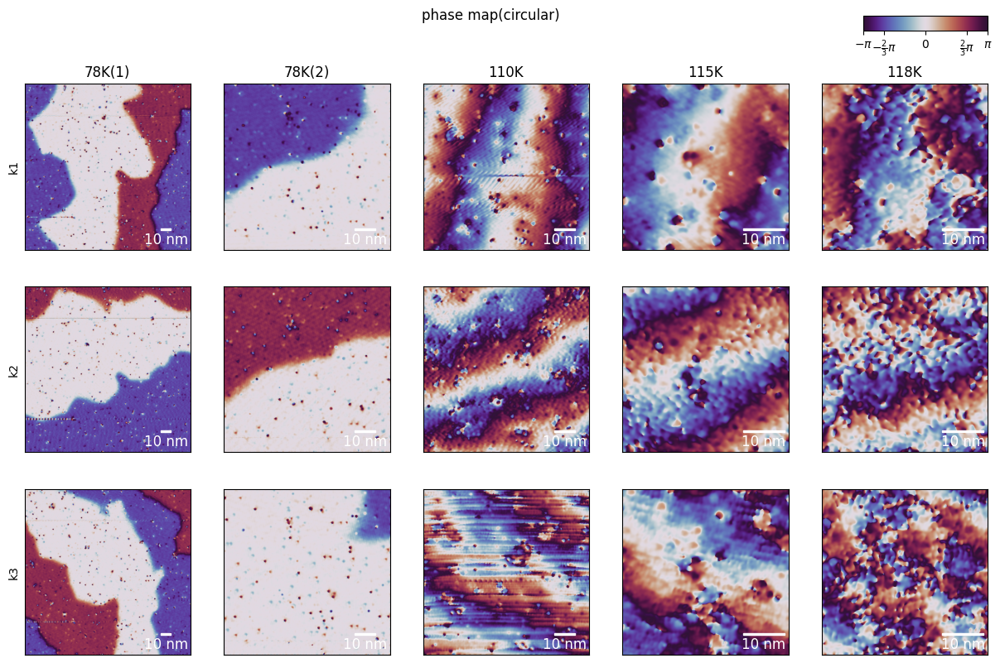
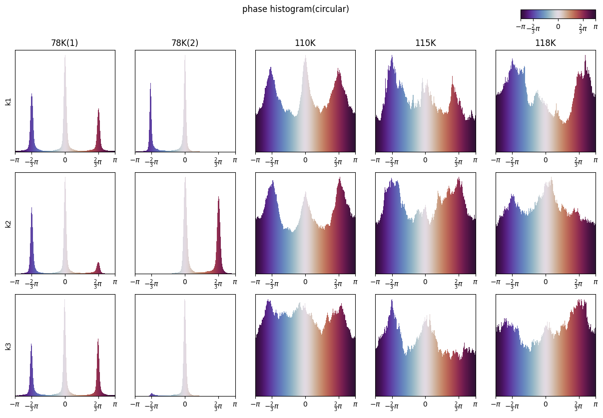
- We can check 3-fold degenaracy in one circular-periodicity.
- The returning length is much longer in 78K than the others.
### Lattice period
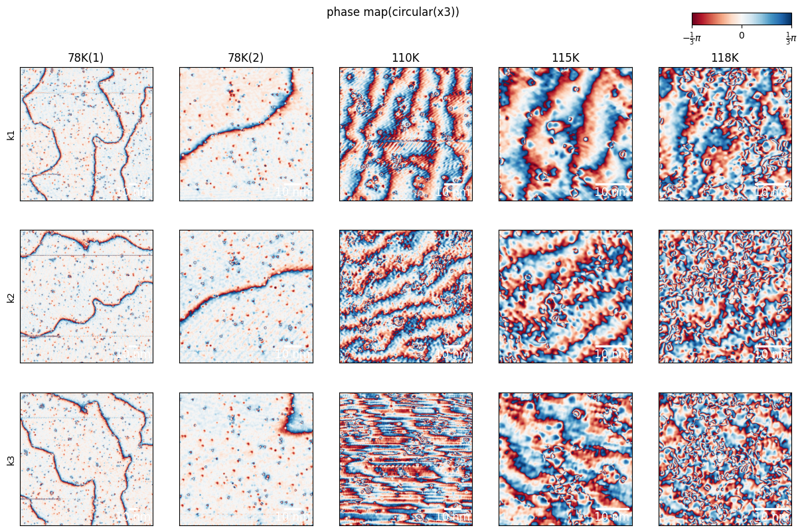
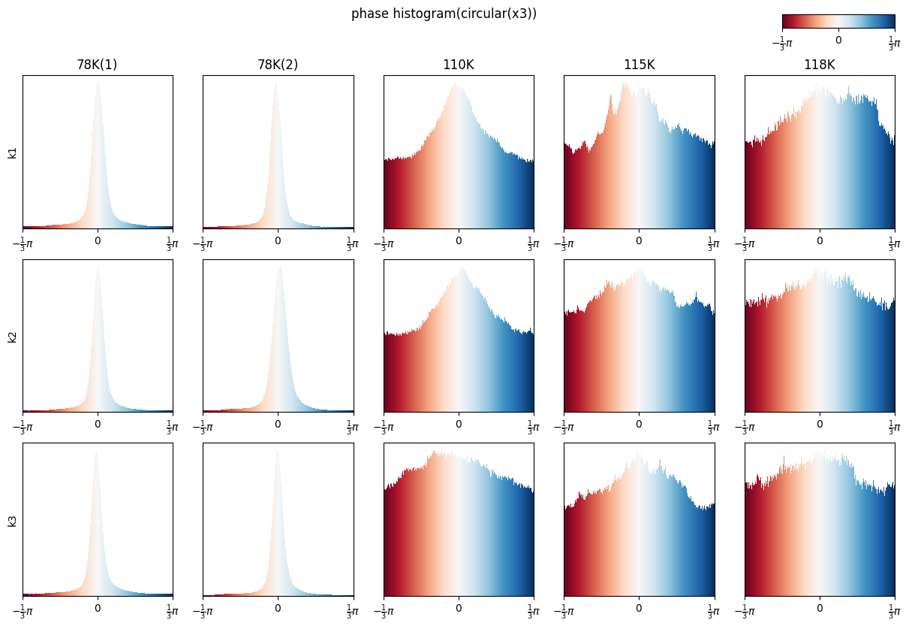
- We can check 3-fold degenaracy in one circular-periodicity.
- As $T$ increase, preference for a particular phase decrease
## phase map
