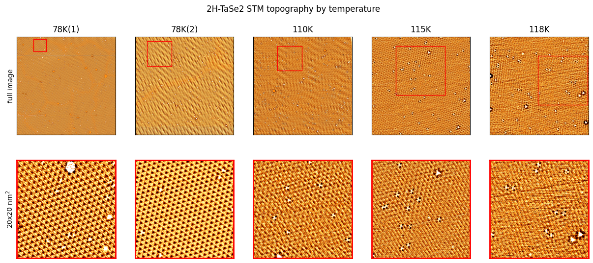
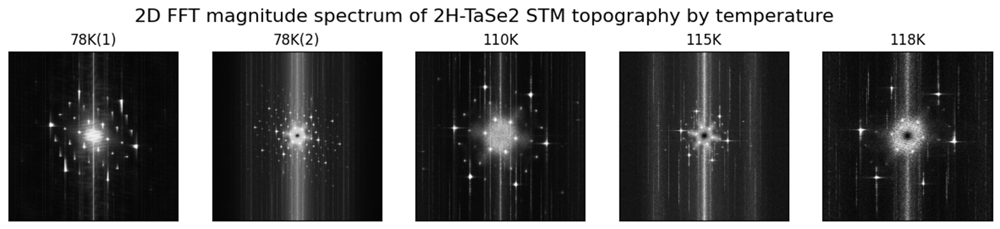
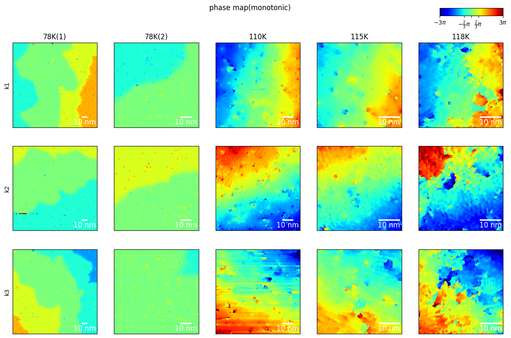
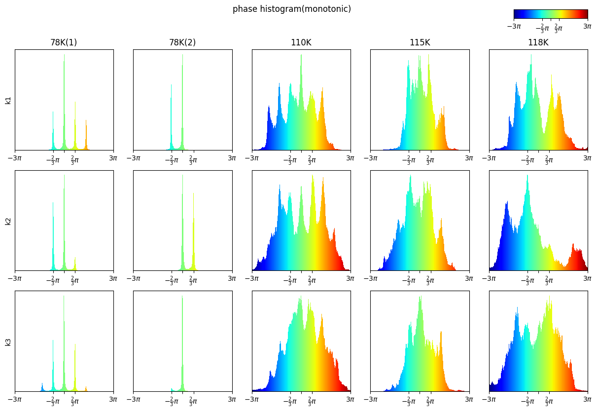
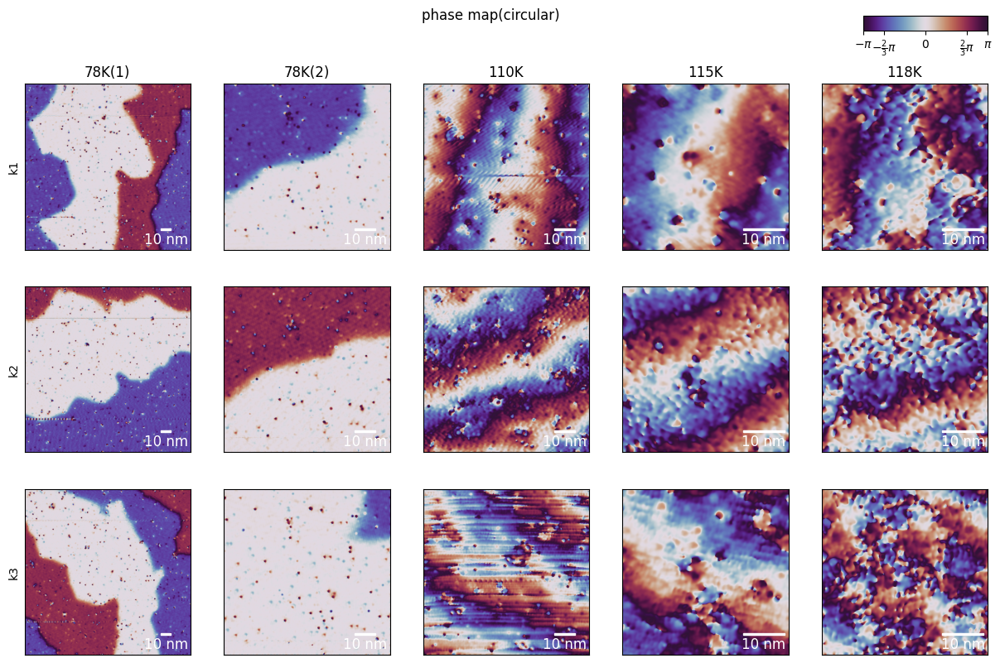
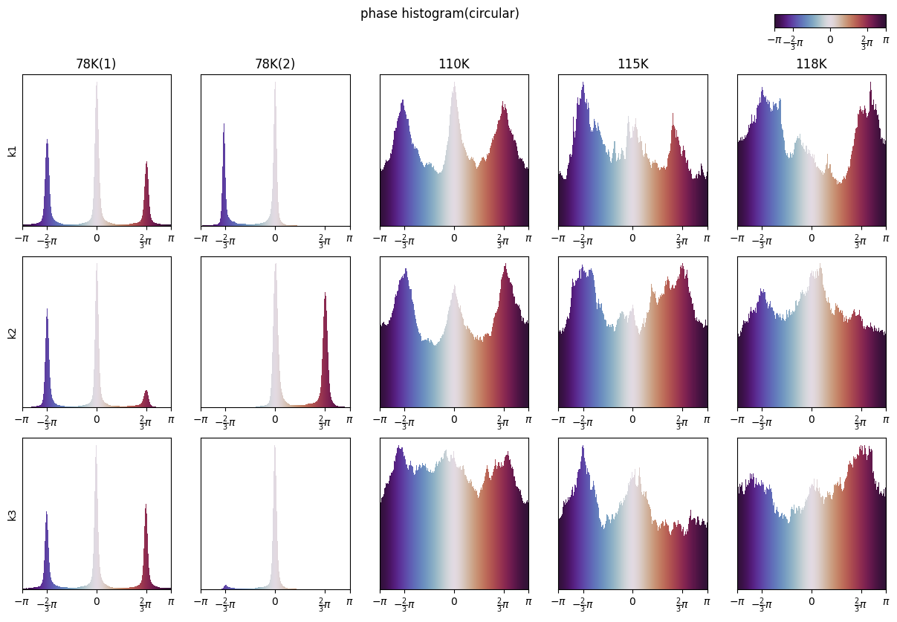
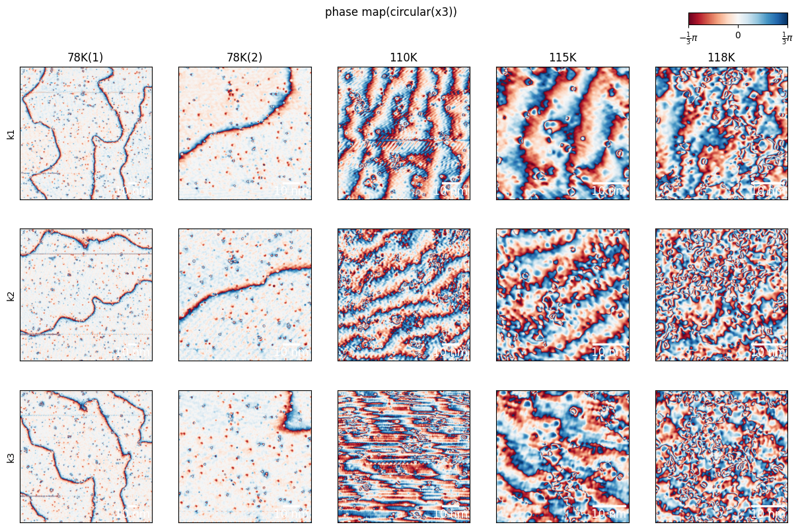
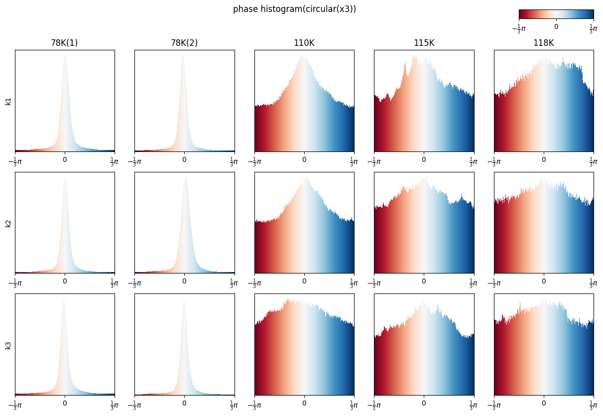

# Variable Temperature
## Topographic Texture

At 78K texture is very uniform. As temperature increase CDW melt down and almost no texture at 118K.
## 2D FFT

## 2D phase map
### global flow

- We can check the flow of phase exist
- the direction is parallel with corresponding k vector.
- some phase are more prefered than the others and seems periodic.
considering
### CDW period

- We can check 3-fold degenaracy in one circular-periodicity.
- The returning length is much longer in 78K than the others.
### Lattice period

- We can check 3-fold degenaracy in one circular-periodicity.
- As $T$ increase, preference for a particular phase decrease