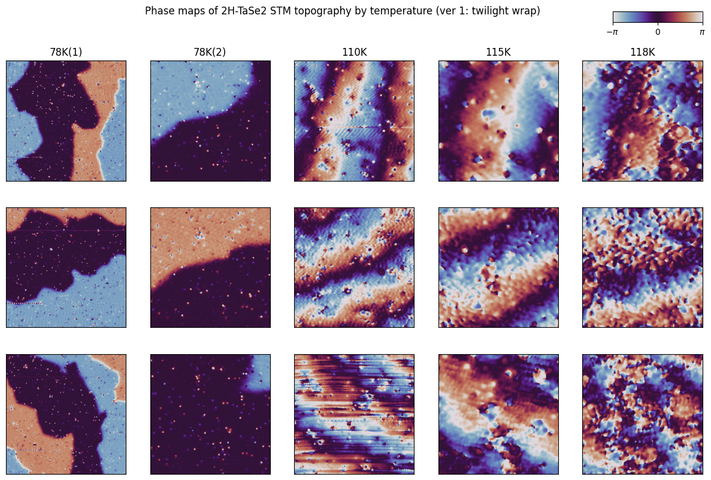
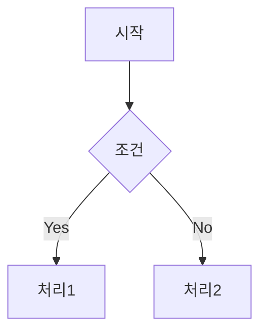

# 프로젝트 할 일 목록 🚀

## 🔥 긴급
- intergrated version
- define correlation length 

## ✨ 신규 기능
- Change guage using new histogram plot
- remove scar
- histogram ylabel name
- 

## 💡 아이디어
- 320nm DW dynamics
- OOP all process
- defect varying phase

