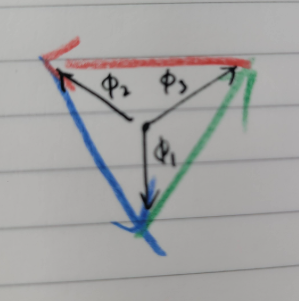
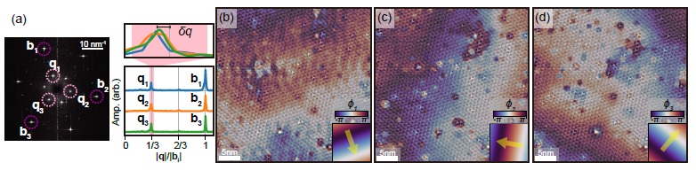
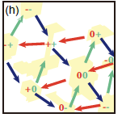
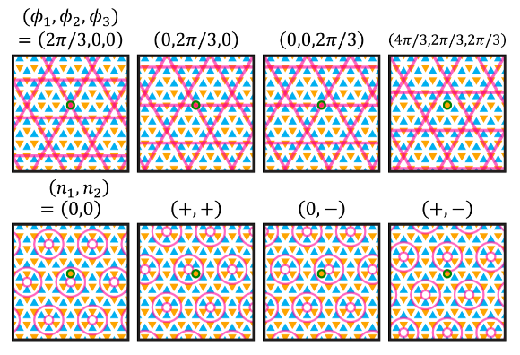
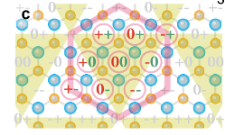

|$(n_1,n_2)$|$(\phi_1,\phi_2,\phi_3)$|
|---|---|
|$(0,0)$|$(+2\pi/3,0,0)$|
|$(+,0)$|$(+2\pi/3,+2\pi/3,-2\pi/3)$|
|$(0,+)$|$(0,0,+2\pi/3)$|
|$(-,-)$|$(-2\pi/3,-2\pi/3,0)$|
|$(+,-)$|$(-2\pi/3,+2\pi/3,+2\pi/3)$|
|$(-,0)$|$(+2\pi/3,-2\pi/3,+2\pi/3)$|
|$(0,-)$|$(-2\pi/3,0,-2\pi/3)$|
|$(+,+)$|$(0,+2\pi/3,0)$|
|$(-,+)$|$(0,-2\pi/3,-2\pi/3)$|